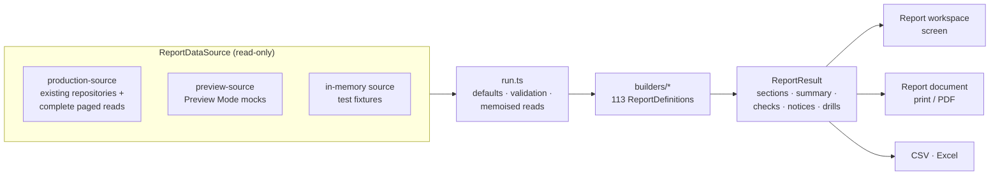

# VYRON Reporting Centre

A single, read-only reporting engine behind **113 reports** across twelve
areas — Management, Financial, Customers, Suppliers, Sales, Purchasing,
Banking, VAT & Tax, General Ledger, Inventory, Audit & Compliance and the
Document Centre — all sharing one report shell, one filter vocabulary, one
set of actions (Print, PDF, Excel, CSV, Email where supported, Save view,
Copy link) and one drill-down model.

Every report states on the page what it reconciles to and whether it does.
A failing reconciliation is shown with its difference and a plain-language
explanation — never hidden.

---

## 1. Audit of reporting before the Reporting Centre

| Area | What existed | Where |
|---|---|---|
| Financial statements | Income Statement, Balance Sheet, Cash Flow, Statement of Changes in Equity engines (Trial-Balance snapshot diff) | `src/server/reporting/*-engine.ts`, `financial-statements-service.ts`, Reports → Financial Statements, Financial Statements page |
| Budgets | Budget capture + Budget vs Actual (dimension-filtered) | Reports → Management Reports |
| Forecasting / alerts | Linear-regression forecasts, executive alerts, scores | Reports → Forecasting / Executive Alerts |
| Report Designer | Saved report definitions dispatching to TB/IS/BS/CF/GL Inquiry | `report-run-service.ts`, Reports → Report Designer |
| General Ledger | Trial Balance (+ CSV/XLSX export), GL Inquiry (keyset paged), Account Activity, Journals | General Ledger page, `trial-balance-export.ts` |
| Supplier reconciliation | 5 reports: supplier allocation, supplier payment, outstanding suppliers, unknown payments, duplicate payments (client CSV) | Supplier Reconciliation page, `report-viewer.tsx` |
| Customer statement | Running-balance statement, printable document, PDF, email | `customer-statement-engine.ts`, `statement-document.tsx`, Matching → Customers |
| Supplier statement | Running-balance engine, JSON only (no document) | `supplier-statement-engine.ts` |
| Sales documents | Invoice / credit / debit note document, PDF, email | `invoice-document.tsx`, `pdf-generation-service.ts` |
| VAT | VAT201 summary engine, returns workflow, exceptions, VAT audit trail tab | `vat-201-engine.ts`, VAT page |
| Banking | Reconciliation engine and workspace, bank account summaries | `reconciliation-engine.ts`, Cashbook / Bank Accounts |
| Exports | Client CSV helper; server XLSX for TB, transactions, banking rules | `lib/csv-export.ts`, `trial-balance-export.ts`, `transaction-export.ts` |
| PDF | Puppeteer renders a document page (invoice, statement) | `pdf-generation-service.ts` |

**Missing entirely:** customer/supplier ledgers, detailed ledgers, aging
and aging detail (only summary buckets on the customer/supplier screens),
registers, payment history, supplier statement document, sales and
purchase analyses, gross margin, VAT detail/reconciliation/control
account, bank ledger, bank-to-GL reconciliation, import/Xero audits,
transaction lifecycle, audit trail, journal detail with source tracing,
comparative/monthly/annual P&L, management pack, stock reports, and a
document reprint centre for quotes, orders, receipts, purchase orders,
bills and remittance advices.

### Defects found by the audit

1. **Statements and balances did not include bank-settled money.** A bank
   transaction allocated to a supplier or customer (Transaction Explorer
   type `S`/`C`, migration 0096) posts straight to the Creditors/Debtors
   control account and creates no payment/receipt record. The existing
   statement engines read only payment/receipt records, and ignored posted
   opening balances — so a statement could never reconcile to the control
   account. The Reporting Centre's subsidiary-ledger engine
   (`party-ledger.ts`) includes every source that moves a control
   account. *The existing Matching-screen statement, its PDF and email are
   unchanged* — replacing them with the new engine is recommended.
2. **Lists silently capped at 1,000 rows.** Repository `list*` functions
   use `.limit(10_000)`, but PostgREST caps every response at `max_rows`
   = 1000 (`supabase/config.toml`). The Reporting Centre reads through
   `report-centre-repository.ts`, which pages every table to completion
   and reports truncation rather than hiding it. *Existing screens are
   unchanged* — worth reviewing.
3. **Every document PDF printed as a near-black page.** The shared
   `DocumentPreviewOverlay` hid the app for print but never reset the
   dark `<body>` background, which `page.pdf({ printBackground: true })`
   prints. Measured by rasterising a generated PDF (mean brightness
   10/255). **Fixed** in the shared overlay — this also fixes the existing
   invoice and statement PDFs.

---

## 2. Architecture

| Module | Role |
|---|---|
| `src/server/report-centre/types.ts` | The one report contract: filters, columns, rows, drill targets, reconciliation checks |
| `source.ts` | `ReportDataSource` interface, per-run memoisation, in-memory source, `fn_trial_balance` reproduced in memory |
| `production-source.ts` / `preview-source.ts` / `source-for-company.ts` | Live vs Preview Mode data |
| `../repositories/report-centre-repository.ts` | Complete paged reads (same selects and mappers as each module's own repository) |
| `party-ledger.ts` | Subsidiary-ledger engine: customer and supplier ledgers, open items, aging |
| `kit.ts` | Shared definition shape, filters, row/column/drill helpers, control-account reconciliation |
| `builders/*.ts` | Report families (see §3) — reuse the existing statement, VAT201, reconciliation and aging engines |
| `registry.ts` / `run.ts` | Catalogue, defaults, validation, filter options |
| `export.ts` | CSV and Excel from `ReportResult` |
| `documents.ts` / `letterhead.ts` | Document Centre loader with trace links; server-loaded letterhead for print/PDF |
| `src/components/financial/reporting/*` | Workspace shell, filter bar, table, summary/checks/notes, print view, document view |
| `src/app/company/[companyId]/reporting/**` | Home, category workspace, print view, document view |
| `src/app/api/companies/[companyId]/reporting/**` | Report JSON, export (csv/xlsx/pdf), statement email, document PDF |

**Filters live in the URL** (`?report=customer-aging&asAt=…`), so every
view is shareable, bookmarkable, and survives Back/Forward; the server
re-runs the report on each change. Defaults: `dateTo` = today, `dateFrom`
= start of the financial year containing `dateTo`, `asAt` = `dateTo`.

**Access:** a signed-in session plus the RBAC catalog's global
`RunReports` permission (Auditor, Accountant, Financial Manager and every
all-permissions role). Emailing a statement additionally requires
`Sales:Create`, the same as the existing statement email.

### Accounting safety

Reporting is read-only. `read-only.test.ts` scans every Reporting Centre
source file — engine, builders, sources, repository, routes, pages and
components — and fails if any contains a query-builder write
(`insert/update/upsert/delete`), a mutating RPC, or imports a mutating
function (posting, allocation, journal, VAT return, import). The only
side-effecting action is emailing a Customer Statement, which records a
communication and archives the PDF through the existing communication
platform — it never touches the ledger.

---

## 3. Report catalogue

| Area | Reports (home area) |
|---|---|
| Management (10) | Management Pack · Performance Comparison · Top Customers · Top Suppliers · Largest Expenses · Sales & Expense Trend · Cash Position · VAT Position · Overdue Customers · Overdue Suppliers |
| Financial (8) | Statement of Financial Position · Profit & Loss · Detailed P&L · Comparative P&L · Monthly P&L · Annual P&L · Budget vs Actual · Cash Flow Statement |
| General Ledger (12) | Trial Balance · Detailed TB · Comparative TB · General Ledger · Detailed GL · GL Account Activity · GL Account Balances · Journal Register · Posted Journals · Unposted Journals · Journal Detail · Allocation History |
| Customers (16) | Ledger · Detailed Ledger · Statement (emailable) · Balance Summary · Aging · Aging Detail · Transactions · Outstanding Balances · Payment History · Credit Notes · Invoice Register · Receipt Register · Activity · VAT Analysis · Sales Analysis · Profitability |
| Suppliers (16) | Ledger · Detailed Ledger · Statement · Balance Summary · Aging · Aging Detail · Transactions · Outstanding Balances · Payment History · Credit Notes · Bill Register · Payment Register · Activity · VAT Analysis · Purchase Analysis · Spend Analysis |
| Sales (11) | Summary · by Customer · by Product · by Date · by Month · by Category · by VAT Treatment · by Customer/Product · Trends · Outstanding Sales · Gross Margin |
| Purchasing (8) | Summary · by Supplier · by Product · by Date · by Month · by Supplier/Product · Outstanding Purchases · Cost Trends |
| Banking (17) | Bank Transactions · Deposits · Payments · Unreconciled · Reconciled · Bank Ledger · Bank Reconciliation · Bank Statement · Bank Charges · Interest · Account Movement · Bank GL Reconciliation · Imported Transaction Audit · Xero Import Audit · Duplicate Transactions · Transaction Lifecycle · Bank Transaction Trace |
| VAT & Tax (10) | Summary · Detail · Output VAT · Input VAT · Transaction Detail · VAT by Account · Reconciliation · Control Account · Period Summary · VAT Audit |
| Inventory (3) | Stock on Hand · Stock Valuation · Stock Movements |
| Audit & Compliance (1 home, 16 listed) | Audit Trail, plus journal, allocation, import, Xero, duplicate and VAT audit reports from other areas |
| Document Centre (1 home, 4 listed) | Document Register (quotes, orders, invoices, credit/debit notes, receipts, purchase orders, bills, supplier credit notes, remittance advices) plus Customer/Supplier Statement and Bank Statement |

"VAT by Customer/Supplier" are the Customer/Supplier VAT Analysis
reports; "Invoice/Credit Note/Bill Register" are the Customer/Supplier
registers — each also listed under Sales, Purchasing or VAT.

## 4. What each family reconciles

| Family | Reconciliation shown on the report |
|---|---|
| Customer / Supplier ledgers, aging, balances | Ledger total = Debtors / Creditors control account (account named by the company's own posting rules) at the report date; aging buckets + Unallocated = ledger balance; opening + movements = closing; statement closing = its aging total |
| Trial Balance family | Debits = credits; opening and closing TB net to zero; each account's closing balance agrees with the TB |
| Profit & Loss | Net profit from TB snapshots = net profit recomputed from every posted GL line |
| Statement of Financial Position | Assets = liabilities + equity (current and comparative); TB balances |
| Cash Flow | Cash flows = actual movement in cash/bank accounts |
| VAT | Output and input VAT from documents + bank VAT + adjustments = VAT per the VAT Input/Output/Control accounts (excluding settlement journals); each VAT account closing = TB; each VAT return vs current records |
| Sales / Purchases | Net sales (purchases) = sales-invoice (purchase-bill) postings to revenue (expense) in the GL; net + VAT = total |
| Banking | Every posted bank transaction reached the bank's GL account; bank ledger closing = TB; reconciliation cleared items explain the statement closing; imported running balances continuous; every transaction has exactly one lifecycle status |
| Journals | Debits = credits; a posted journal is fully in the GL |
| Stock | Stock valuation = inventory GL accounts |

## 5. Drill-down

Financial statement → GL account activity → journal detail → source
document (invoice, bill, receipt, payment) or bank transaction trace →
import batch, allocation history, posting journal, reconciliation. A
customer or supplier statement row opens the document; the document shows
its trail (journal, receipts/payments that settled it, bank transactions
behind them, related orders). Every level is a report or document with
the same Print / PDF / export actions.

## 6. Honest limitations

- **Gross margin and customer profitability** use each stock item's
  *current* average cost — VYRON holds no historical cost per sale. Lines
  without a costed stock item are excluded from margin and reported as
  "cost coverage". Company gross profit from the GL is on the P&L.
- **Stock on hand / valuation** are current values; there is no
  historical stock snapshot.
- **Budgets** are compared only where captured, as full-year budgets —
  nothing is pro-rated or estimated.
- **Historical aging** before today reconstructs outstanding amounts from
  payment allocations dated on/before the date; from today onward the
  stored outstanding is used.
- **Split bank transactions** are not attributed to customer/supplier
  sub-ledgers (splits carry GL accounts, not settlements).
- **Saved views** are kept in the viewer's browser (no database table was
  added — reporting stays read-only).
- **Email** is available for Customer Statements only.
- **PDF** requires the server's Chromium (Vercel); Preview Mode on a
  developer machine can Print but not generate server PDFs.
- **Preview Mode** sample documents and sample ledger are separate
  illustrations, so some reconciliation checks fail there by design.

## 7. Verification

- `src/server/report-centre/reports.test.ts` — a hand-worked, fully
  coherent fixture ledger (`test-fixtures.ts`); every report is run and
  **every reconciliation check must pass**; key figures asserted by value
  (e.g. Debtors 2,220 = customer ledger; Balance Sheet 13,305 both sides;
  net profit 1,750 two ways; VAT 420/165/255; bank GL 360). A deliberately
  unreconciled ledger proves a failure is reported.
- `documents.test.ts`, `read-only.test.ts`, `reporting-ui.test.tsx`,
  document overlay tests (print background, page pinning, portal).
- Real-browser checks against Preview Mode (Edge + puppeteer-core):
  `scripts/verify-reporting-centre.mjs`; PDFs rendered with production
  `page.pdf()` options and rasterised: `scripts/verify-report-pdfs.mjs`.

## 8. Adding a report

1. Add a `ReportDefinition` to the relevant `builders/*.ts` (id, title,
   description, categories, filters, `build`).
2. Read only through `ctx.source`; reuse the family's helpers and
   existing engines; add a `check(...)` for whatever the report should
   reconcile to, and `notices` for any basis the reader should know.
3. Return drill targets on rows so the report connects to the next level.
4. The report appears in its areas automatically; add assertions to
   `reports.test.ts` — the blanket test already runs it and requires its
   checks to pass on the fixture ledger.
